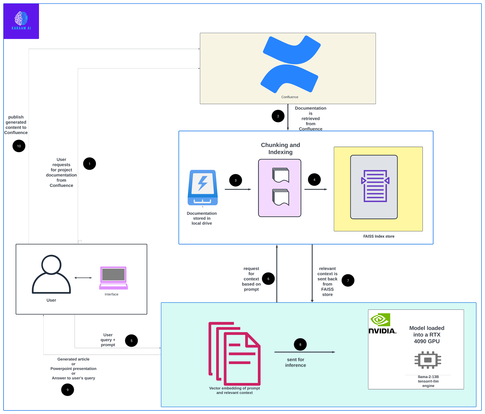

## Getting started
1. Clone the repo: ```git clone https://github.com/MustaphaU/karaamAI.git```
2. Navigate to the root folder: ```cd karaamAI```
3. Download the tensorrt-llm engine and the tensorrt wheel from here: https://www.dropbox.com/scl/fo/3406zfdaxb84o8vwiab8g/h?rlkey=2h599x22h2qa8zjy5028obsh3&dl=0
4. Place the wheel in the `tensorrt_wheel` folder and place the engine in `llama2/engine`
5. Install the tensorrt wheel:
   ```
   pip install tensorrt_wheel/tensorrt_llm-0.7.1-cp310-cp310-win_amd64.whl
   ```
6. Install the other requirements:
```
pip install -r requirements.txt
```

## Launch the app
To launch the app run:
```
streamlit run app.py
```

Your application should take about a minute to start up.. The little delay is necessary for it to fully load the **13B llama model** into the GPU

Once ready, log in with the credentials provided in `credentials.txt` and click `submit`

EDIT 04/03/2024: The API token in `credentials.txt` has been revoked by Atlassian for security reasons. Nonetheless, you should be able to login with your own credentials.

Check out the demo video to see how you might interact with the app.: https://youtu.be/opTpWnb6Ju8 

# Here is a high level architecture




